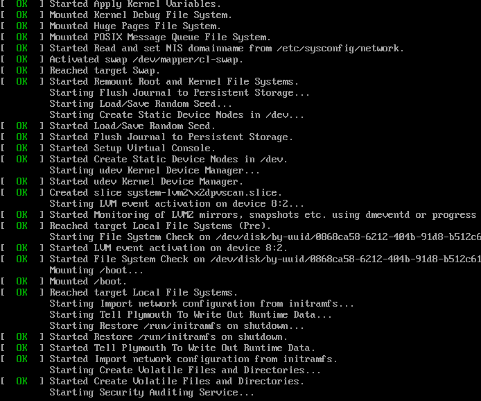

See the init log show if services are functional when your device boots:



```command
sudo plymouth-set-default-theme details
```
Alternatively, create `/etc/plymouth/plymouthd.conf` manually

```command
sudo rpm-ostree initramfs --enable --reboot
```
