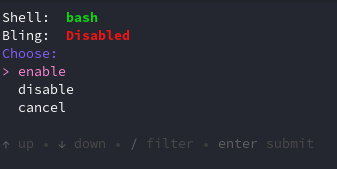

---
authors:
  - "@castrojo"
  - "@nicknamenamenick"
---

<!-- ANCHOR: METADATA -->
<!--{"url_discourse": "https://universal-blue.discourse.group/docs?topic=970", "fetched_at": "2024-09-03 16:43:14.005694+00:00"}-->
<!-- ANCHOR_END: METADATA -->



<sub>You're using bazzite, of course you have the coolest UNIX tools right at your disposal.</sub>

## List of CLI Tools

```
ujust bazzite-cli
``` 
Bazzite's opt-in command line experience. `bazzite-cli` comes with some fantastic command line tools such as:
- [**atuin**](https://github.com/atuinsh/atuin) for shell history
- [**direnv**](https://direnv.net/) to load and unload environment variables depending on the current directory.
- [**eza**](https://github.com/eza-community/eza) as a replacement `ls`
- [**fd**](https://github.com/sharkdp/fd) for `find`
- [**fzf**](https://github.com/junegunn/fzf) for command line fuzzy finding
- [**ripgrep**](https://github.com/BurntSushi/ripgrep) for search
- [**tealdeer**](https://github.com/dbrgn/tealdeer) for `tldr`
- [**ugrep**](https://github.com/Genivia/ugrep) for grep
- [**yq**](https://github.com/mikefarah/yq) - for yaml, json, and xml processing
- [**zoxide**](https://github.com/ajeetdsouza/zoxide) as `cd`

The community may add new tools over time, re-running `ujust bazzite-cli` will pull in the new tools.
