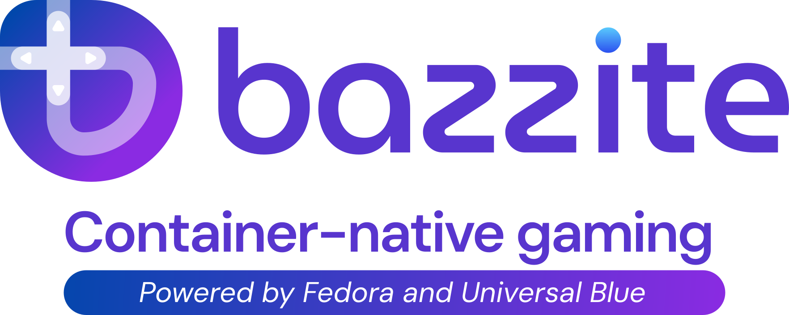

---
authors:
  - "@nicknamenamenick"
  - "@KyleGospo"
  - "@EyeCantCU"
  - "@storyaddict"
  - "@castrojo"
---

<!-- ANCHOR: METADATA -->
<!--{"url_discourse": "https://universal-blue.discourse.group/docs?topic=33", "fetched_at": "2024-09-03 16:43:17.727110+00:00"}-->
<!-- ANCHOR_END: METADATA -->

# Frequently Asked Questions



## Why is it called Bazzite?

[Fedora Linux's Atomic Desktops](https://fedoraproject.org/atomic-desktops/) originally followed a naming scheme based on [minerals.](https://fedoraproject.org/kinoite/) Bazzite is a mineral that is known for being strong, lightweight, and is colored [blue](https://universal-blue.org/).

## What is the difference between SteamOS and Bazzite?

Bazzite originally was developed for the Steam Deck targeting users who used their Steam Deck as their primary PC. Bazzite is a collection of custom Fedora Atomic Desktop images (with the power of [libostree](https://ostreedev.github.io/ostree/)) built with Universal Blue's tooling (with the power of [OCI](https://opencontainers.org/about/overview/)) as opposed to using an [Arch Linux](https://archlinux.org/) base with A/B updates utilizing [RAUC](https://github.com/rauc/rauc).  The main advantages of Bazzite versus SteamOS is receiving system packages in updates at a much faster rate, choice of an alternative desktop environment, [Waydroid support](https://docs.bazzite.gg/Installing_and_Managing_Software/Waydroid_Setup_Guide/), [layering system-level packages at your own risk without messing with the filesystem](https://docs.bazzite.gg/Installing_and_Managing_Software/rpm-ostree/), and printing support.

>A full list of major differences can be found in the [Steam Deck wiki entry](https://docs.bazzite.gg/Handheld_and_HTPC_edition/Handheld_Wiki/Steam_Deck/#how-similar-is-bazzite-to-steamos-on-steam-deck-hardware) and the [Bazzite README](https://github.com/ublue-os/bazzite/blob/main/README.md).

## What Bazzite image do I use?

Bazzite's [website](https://bazzite.gg/#image-picker) offers a streamlined way of selecting the correct image which will be chosen based on hardware, desktop environment, and to include Steam Gaming Mode if the hardware supports it.

Bazzite offers multiple images, but most images will be following _one of these **two formats**_:

- Bazzite images that do **not** have Steam Gaming Mode and receive automatic updates daily.
- Bazzite images that automatically boots into Steam Gaming Mode with manual updates (like SteamOS).

**Images are split up between **two** types of Bazzite editions**:

### 1. Desktop Edition

!!! important
    
    **Steam Gaming Mode is not on these specific images!**

Intended specifically for desktops and laptops with a focus on gaming which is influenced by SteamOS's Desktop Mode and the maintenance-free nature of ChromeOS. A gaming-focused Fedora Atomic Desktop (Kinoite/Silverblue) operating system.  Steam and other gaming utilities are part of the base operating system. System rollbacks available with a rock-solid stable Fedora Linux base. Most modern PC hardware should be compatible outside of specific drivers that do not work well on desktop Linux.  [Flathub](https://flathub.org/) is enabled out of the box, so all of the applications that you would find on SteamOS are available on Bazzite.  System and application updates are automatically downloaded in the background and applied on a restart by default. 

**All Nvidia hardware can currently only use the Desktop Edition since the graphic drivers do not support Steam Gaming Mode**.


### [2. Bazzite-Deck Edition](../Handheld_and_HTPC_edition/Steam_Gaming_Mode.md)

Mimics SteamOS with "**Steam Gaming Mode**" and its features fully functional. This version of Bazzite boots directly into the Steam Gaming Mode session and are intended for handheld PCs and home theater setups.  You can still run `-deck` images on your desktop if desired.  Images also includes a Desktop Mode session based on the Desktop images. System and application updates are manually installed in Steam Gaming Mode and applied on a restart.

!!! important
    
    Steam Gaming Mode **requires** a modern AMD graphics card or an Intel Arc graphics card.

#### Desktop Environments & Specific Hardware Variants

Both types of images also come with the choice of using [KDE Plasma](https://kde.org/plasma-desktop/) or [GNOME](https://www.gnome.org/) for the desktop environment and certain images are made with specific hardware support.

>There is more information about this topic on the [**Installation Guide**](../General/Installation_Guide/index.md) to help guide users on which image to choose before the installation.

### Bazzite Image Chart

| Image                       | Desktop Environment | Steam Gaming Mode | Hardware                                 | Edition       |
| --------------------------- | ------------------- | ----------------- | ---------------------------------------- | ------------- |
| `bazzite`                   | KDE Plasma          | No                | AMD/Intel GPUs                           | Desktop       |
| `bazzite-nvidia`            | KDE Plasma          | No                | Nvidia GPUs                              | Desktop       |
| `bazzite-nvidia-open`            | KDE Plasma          | No                | Nvidia GPUs (open kernel modules, newer Nvidia GPUs only)                             | Desktop       |
| `bazzite-gnome`             | GNOME               | No                | AMD/Intel GPUs                           | Desktop       |
| `bazzite-gnome-nvidia`      | GNOME               | No                | Nvidia GPUs                              | Desktop       |
| `bazzite-gnome-nvidia-open`      | GNOME               | No                | Nvidia GPUs (open kernel modules, newer Nvidia GPUs only)                            | Desktop       |
| `bazzite-deck`              | KDE Plasma          | Yes               | AMD/Intel Arc GPUs                       | Bazzite-Deck |
| `bazzite-deck-gnome`        | GNOME               | Yes               | AMD/Intel Arc GPUs                       | Bazzite-Deck |
| `bazzite-asus`              | KDE Plasma          | No                | ASUS Laptops (AMD/Intel GPUs             | Desktop       |
| `bazzite-asus-gnome`        | GNOME               | No                | ASUS Laptops (AMD/Intel GPUs)            | Desktop       |
| `bazzite-asus-nvidia`       | KDE Plasma          | No                | ASUS Laptops (Nvidia GPUs)               | Desktop       |
| `bazzite-asus-nvidia-open`       | KDE Plasma          | No                | ASUS Laptops (Newer Nvidia GPUs)               | Desktop       |
| `bazzite-gnome-asus-nvidia` | GNOME               | No                | ASUS Laptops (Nvidia GPUs)               | Desktop       |
| `bazzite-gnome-asus-nvidia-open` | GNOME               | No                | ASUS Laptops (Newer Nvidia GPUs)               | Desktop       |
| `bazzite-ally`              | KDE Plasma          | Yes               | ASUS Laptops (Steam Gaming Mode Enabled) | Bazzite-Deck |
| `bazzite-ally-gnome`        | GNOME               | Yes               | ASUS Laptops (Steam Gaming Mode Enabled) | Bazzite-Deck |

Verify your image by entering this **commmand**:

```
rpm-ostree status
```

Every Bazzite image should be `rpm-ostree rebase ostree-image-signed:docker://ghcr.io/ublue-os/...`

<sub> The `...` is a placeholder for the actual image name which can be referenced in the chart above. </sub>

### Who are the target audiences?

*>* Individuals who desire a desktop operating system designed for gaming with inspiration from SteamOS that has fairly low maintenance.

*>* Steam Deck users who feel limited by SteamOS and also want newer system packages.

*>* Individuals who want a console-like experience.

*>* [Handheld PC](../Handheld_and_HTPC_edition/Handheld_Wiki/index.md) users who would prefer a SteamOS-like experience.

## SteamOS is based on Arch Linux, so why use Fedora Atomic Desktop?

SteamOS receives package and driver updates less frequently despite the rolling release base.  Bazzite will follow Fedora's update release cycle which means early access to new graphics card driver and kernel updates in comparison to SteamOS.  Fedora Linux and Universal Blue currently supports a specific "atomic" implementation to maintain multiple images that can receive all of the same updates at once, which is unlike a derivative Linux distribution.  The **goal** of Bazzite is to have an operating system ready to game after installing it.

#### Any advantages to using Fedora Atomic Desktop?

Since Bazzite is a custom Fedora Atomic Desktop image, it makes use of read-only root files for stability purposes, and is built with [libostree](https://docs.fedoraproject.org/en-US/fedora-silverblue/technical-information/) which has advantages such as:

- Low risk of an unbootable system
- Rollback system updates if necessary, and the ability to pin your current deployment as a backup save state without losing user data.
- Smooth upgrade process from major Fedora point releases.
- Layer Fedora packages to the host that survive between updates.
- Focus on containerized applications that do not interfere with your host system.

> Check out the [**Universal Blue homepage**](https://universal-blue.org) for more information on what this project is capable of.

### How is Fedora Atomic Desktop different than Fedora Workstation?

If you're familiar with [Fedora Workstation](https://www.fedoraproject.org/workstation/) and [Fedora's Spins](https://www.fedoraproject.org/spins/), but not the Fedora Atomic Desktops paradigm then the major difference deals with obtaining a reproducable and consistent OS image, seperation between installing additional software and the system, and stability between system upgrades. Here's a helpful [cheat sheet](https://docs.fedoraproject.org/en-US/fedora-silverblue/_attachments/silverblue-cheatsheet.pdf) for using **advanced** commands, but gives a glimpse of what this paradigm is capable of. There is also a future planned ahead of this technology like the upcoming addition of [bootc](https://containers.github.io/bootc/) which will be a major change when it is ready for production.

#### Software & Updates

There are **read-only root files** and an emphasis on installing applications as a [Flatpak](https://docs.bazzite.gg/Installing_and_Managing_Software/Flatpak/), [Homebrew](https://docs.bazzite.gg/Installing_and_Managing_Software/Homebrew/), or inside of a [Distrobox container.](https://docs.bazzite.gg/Installing_and_Managing_Software/Distrobox/)

>**Read more about [obtaining software on Bazzite](../Installing_and_Managing_Software/index.md)**.

Users can also rollback to a previous deployment if a system update breaks their workflow, or rebase entirely back to a stock Fedora Atomic image, [Aurora](https://getaurora.dev/), [Bluefin](https://projectbluefin.io/), or a [custom image by the community](https://universal-blue.discourse.group/t/list-of-community-created-custom-images/340). Do **not** rebase between different desktop environments. 

>**Read more about how [updates, rolling back, and rebasing works on Bazzite](../Installing_and_Managing_Software/Updates_Rollbacks_and_Rebasing/index.md)**.

### Is this another fringe Linux distribution?

Bazzite is **not** a Linux distribution in the traditional sense. It's a custom Fedora Atomic Desktop image with a recipe on top of it. Universal Blue images are a proof of concept of using containerized workflows with transactional and in-place operating system updates, and Bazzite exists by being gaming focused with inspiration from SteamOS.  Bazzite is a Fedora Atomic Desktop installation, but with the aid of Universal Blue's tooling, adds packages, services, drivers, etc. to the base image of it.

#### How does Bazzite differ?

Bazzite is using a new "**container-native**" approach that Fedora has been testing, and we are taking full advantage of it.  We are utilizing the [Open Container Initiative (OCI)](https://opencontainers.org/about/overview/) to build the images, and are adding packages, services, kernel modules, and our own spin to existing Fedora operating systems. Unlike traditional Linux distributions, **most of the maintenance and security updates are done upstream** by Fedora and Universal Blue while Bazzite only has to focus on creating a great experience for PC gaming.  The ultimate goal of Bazzite is to be Fedora Linux, but provide a great gaming experience out of the box while also being an alternative operating system for the Steam Deck.

##### Image Matrix

We provide several different images that all get the same additions and fixes through updates at the same time unless specified otherwise. Many images are hardware specific for compatibility reasons, yet all of the images will usually receive the same features and fixes at the same time.  There can be a hypothetical scenario where everyone involved with Bazzite could stop maintaining the project at once and it will still continue to receive updates directly from upstream until the scheduled builds are busted.


## What are some of the utilities that Bazzite ships?

(_in alphabetical order_)

- [Boxkit](https://github.com/ublue-os/boxkit): Tool used for custom OCI Distrobox/Toolbox containers, and anything from [DaVinci Resolve](https://github.com/zelikos/davincibox) to [OBS Studio Portable](https://github.com/ublue-os/obs-studio-portable) can be accessed with this. (The software is in their own special container, so dependencies do not affect your host.)
- [Discover Overlay](https://github.com/trigg/Discover): Discord chat overlay integration for Steam Gaming Mode which has a [special configuration](https://trigg.github.io/Discover/bazzite) for Bazzite where it launches automatically
- [Handheld Daemon](https://github.com/hhd-dev/hhd): Tool for configuring and managing handheld devices from gyro, LEDs, paddles, and TDP.
- [Ptyxis](https://devsuite.app/ptyxis/): Terminal with first-class container support.
- [`ujust`](../Installing_and_Managing_Software/ujust.md): Execute custom commands based on recipes.
- [yafti (Bazzite Portal)](https://github.com/ublue-os/yafti/): First-boot utility for installing additional software.

## Is Secure Boot supported?

!!! warning
    
    The Steam Deck does not come with secure boot enabled and does not ship with any keys enrolled by default, so do not enable this on Steam Deck hardware unless you absolutely know what you're doing! (Steam Deck hardware only)

**Yes**, but you will have to enroll our key.  More information on enrolling the key in our [Secure Boot guide](https://universal-blue.discourse.group/docs?topic=2742).

## Are AMD, Intel, and Nvidia graphics card drivers pre-installed?

**Yes** and they are updated during a system upgrade when available.

### What if I change hardware?

Most hardware changes should **not** require any manual intervention outside of the expectations from that particular hardware which would be OS-agnostic.  However, if you swap from or to a Nvidia GPU, then [rebasing](../Installing_and_Managing_Software/Updates_Rollbacks_and_Rebasing/rebase_guide.md) will be necessary as a manual intervention to get the appropriate graphics drivers.

## Can this be used as a daily driver?

**Yes**.  Updates are obtained and downloaded straight from upstream which means there is little maintenance to be done with the image on our end since these images are modified Fedora images. Users will receive application and system updates from Bazzite, Universal Blue, and Fedora daily.

## What is the `:0` and `:1` in the GRUB menu at boot?

These are deployments and **there's a bug where they get duplicated**, which is why there are 4 entries when there should be two by default unless a specific deployment is pinned.  This allows users to rollback a bad system upgrade by selecting the previous deployment.

- `:0` = Current deployment/newest update
- `:1` = Previous deployment/update.

Deployments can also be pinned to rollback for future use, so `:2`, `:3`, etc. can also exist as long as you have the storage for it.

>**See also**: [Rolling Back System Updates](https://docs.bazzite.gg/Installing_and_Managing_Software/Updates_Rollbacks_and_Rebasing/rolling_back_system_updates/)

## Can I...?

### Can I uninstall pre-installed applications (that are not [Flatpaks](https://docs.bazzite.gg/Installing_and_Managing_Software/Flatpak/))
Not recommended and due to technical limitations. The uninstalled packages will result in slower updates and take up more storage space.  We recommend hiding it from the application menu instead.

### Can I use AMD Fluid Motion Frames?

The AMD drivers for Linux does not support this at a driver-level like it does on Windows.  Most of these graphical effects that work at a driver-level on Windows only work for games that support it in their options menu on Bazzite (or other Linux operating systems) outside of AMD'S FSR 1 and Nvidia's DLSS which are at a driver-level.

### Can I change the hostname of my device?

!!! note

    Hostnames must be **under 20 characters** due to a limitation with Distrobox containers.

Edit the `/etc/hostname` file with a new hostname, save it, and reboot.

```
hostnamectl hostname <hostname>
```

### Can I use _this_ desktop environment or _that_ standalone window manager?

Make your own [custom image based off Bazzite](https://docs.bazzite.gg/Advanced/creating_custom_image/) with the DE and WM change that you want.

### Can I use or modify Java?

If its for Minecraft, then install the [Prism Launcher](https://flathub.org/apps/org.prismlauncher.PrismLauncher) for mods that require anything Java related. If Java needs to be modified for development or a mod then use [Distrobox](../Installing_and_Managing_Software/Distrobox.md). You will **not** be able to change Java on your host at a system level.

### Can I rebase to a different desktop environment?  (Example: KDE Plasma to GNOME)

It is **not recommended to rebase between desktop environments** due to configuration files having different standards which usually lead to broken installations after rebasing between two different DEs.

>[Read more about Rebasing on Bazzite.](https://docs.bazzite.gg/Installing_and_Managing_Software/Updates_Rollbacks_and_Rebasing/rebase_guide/)

## I have questions or concerns that cannot be answered in the documentation

Please try searching for your question on **https://docs.bazzite.gg** first before proceeding with the next steps. Reach out to us on our [forums](https://universal-blue.discourse.group/c/bazzite/5) or [Discord](https://discord.gg/WEu6BdFEtp) if you have a specific question about something, but if it's an issue or bug you are encountering then [report it to the issue tracker](https://docs.bazzite.gg/General/reporting_bugs/).  Keep in mind that certain areas and topics are out of our control especially when it comes to Nvidia driver problems, game compatibility, or other problems that plague the modern day Linux desktop.

## What is the difference between Bluefin, Aurora, and Bazzite?

**TL;DR**: Bazzite is the gaming-centric version of Bluefin (GNOME) and Aurora (KDE Plasma), and all three are Universal Blue Fedora custom images intended for end users.

[Bluefin](https://projectbluefin.io/) and [Aurora](https://getaurora.dev) are nearly identical outside of branding and desktop environment. Bazzite is a different image that shares similarities with both Bluefin and Aurora, and all three function relatively the same for desktop PCs and share contributors between projects. Bluefin and Aurora target two audiences: 
- Individuals who want a maintenance-free Linux desktop experience
- Developers who work with containers (using their `-dx` images)

Bazzite exclusively focuses on having an out of the box Linux gaming experience for desktop, HTPC hardware, and handhelds as a priority. Bazzite can be summed up as Bluefin and Aurora designed for PC gaming.  Bazzite, Bluefin, and Aurora are community-centric custom Fedora Atomic Desktop that are configured for their specific target audience. Bazzite specifically targets PC gamers who want to use the Linux desktop as an alternative to Windows on a wide variety of hardware setups.

## Why are builds failing?


Do not be alarmed if you see this on our [Github repository](https://github.com/ublue-os/bazzite/). Builds can fail for a number of reasons, but it's only temporary. You can still install and use Bazzite without any issues. Latest features and fixes may be delayed until the builds are successfully built again however.

<hr>

**See also**: [Upstream Fedora Silverblue FAQ](https://docs.fedoraproject.org/en-US/fedora-silverblue/faq/)

<-- [**View all Bazzite documentation**](../index.md)
