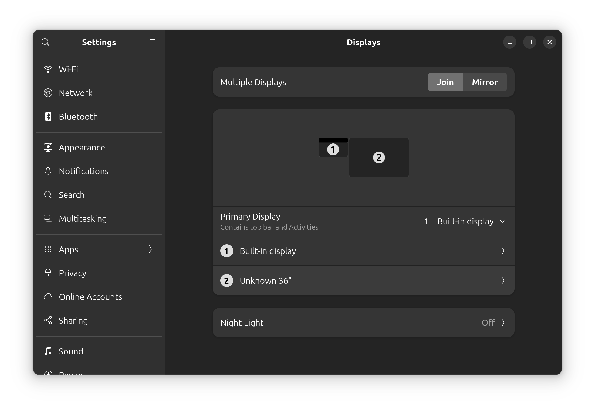
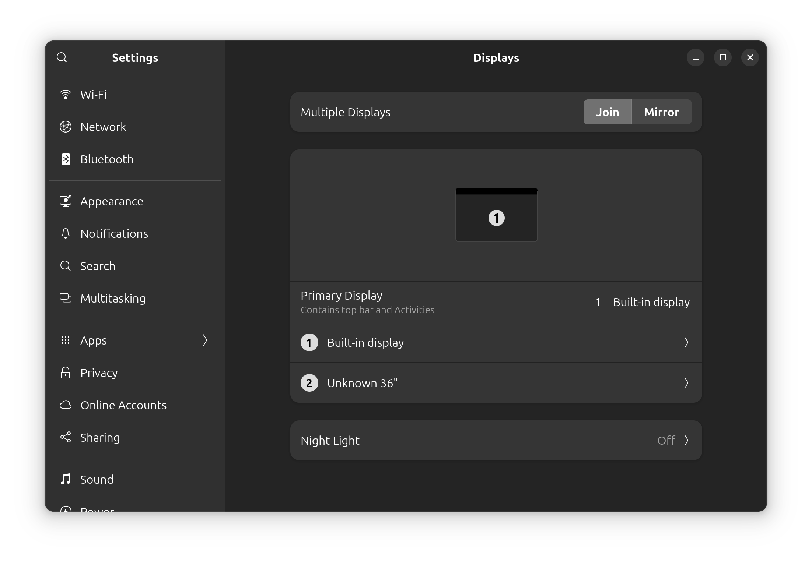

---
authors:
  - Matt_Hartley
---

<!-- ANCHOR: METADATA -->
<!--{"url_discourse": "https://universal-blue.discourse.group/docs?topic=1818", "fetched_at": "2024-09-03 16:43:26.585334+00:00"}-->
<!-- ANCHOR_END: METADATA -->

## 1. Download the image

Download the Framework Laptop image of [Bazzite](https://bazzite.gg/). Make sure you select Intel or AMD depending on the mainboard in your device:

## 2. Create a USB bootable stick

**Create a USB stick** using [Fedora Media Writer](https://docs.fedoraproject.org/en-US/fedora/latest/preparing-boot-media/#_on_windows) ([Windows](https://fedoraproject.org/fmw/FedoraMediaWriter-win32-latest.exe) or [Mac](https://fedoraproject.org/fmw/FedoraMediaWriter-osx-latest.dmg) or [Linux](https://flathub.org/apps/org.fedoraproject.MediaWriter))

- Insert your USB drive (8GB or larger). Note that it will be reformatted, so make sure you are ok with erasing any data that is on it.
- After installing Fedora Media Writer, run it. Choose Select .iso file, browse to bazzite-gnome-stable.iso (GNOME) or bazzite-stable.iso (KDE) and select it.
- Click the Write button.
- Once the USB drive creation is complete, you can click Finish, close Fedora Media Writer, eject your USB drive.

## 3. Booting to the Bazzite USB

- Insert the USB drive into your powered off Framework Laptop 13, and then power on. If you have an existing OS installed on the Storage drive in your laptop, immediately after the power light comes on begin rapidly tapping (continuously ) the F12 key - you must begin tapping well before you see the Framework logo.
- Select Linpus lite (General UDisk) with your arrow keys. Enter key.
- Next select Install Bazzite. Hit the enter key.
- Select the keyboard language you’d like to use. On the next screen, click on the Installation Destination button to choose the disk.
- If there is an OS already installed on the target drive, you’ll need to follow the guided steps to delete the existing partitions.
- Click Finish Installation and then reboot into your new Bazzite install!

----------

**An additional note on Framework Laptop 13 (Intel® Core™ Ultra Series 1)**

While it will work out of the box, if you are on kernel 6.10.10, you will notice two things:

- Your cursor seems to be missing. Motion your touchpad to the left, it will appear. If you wish to remain on gts or stable, you can simply disable the ghost display.

**Ghost display:**

**Disabled ghost display:**

- If you are on Framework Laptop 13 (Intel® Core™ Ultra Series 1) and wish to get the best experience with VRR and avoiding the ghost display, open a terminal and run `ujust --choose` then select` rebase-helper`.

- Select `rebase` and then arrow down to `latest`. Let the rebase happen.

- `systemctl reboot` when complete. This is going to get you onto a newer kernel that is going to play better with the 2.8k display.

- If you wish to enable GNOME VRR, `ujust --choose`, select `toggle-gnome-vrr`, select `enable` and when complete you can log off and log back in. Go to Settings, Displays, you will see it available under Refresh Rate.
