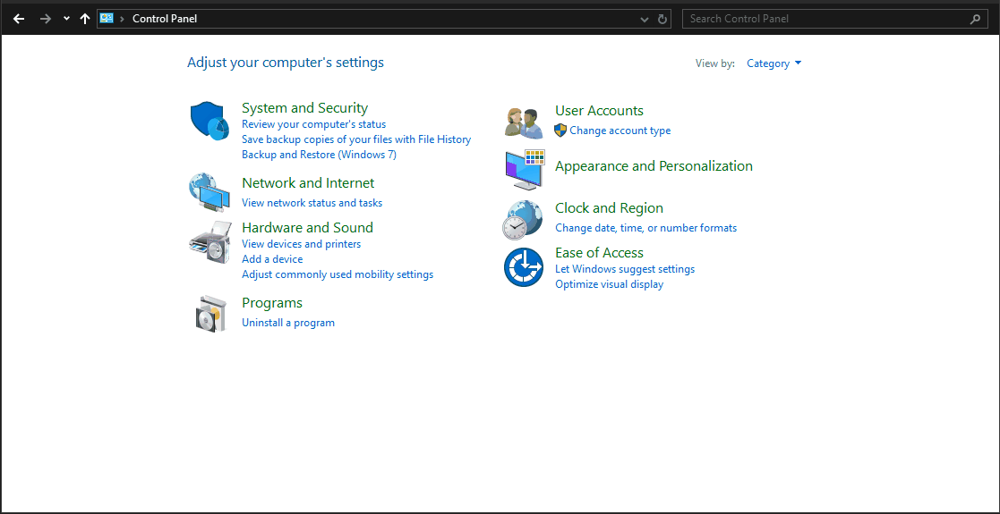

# Issues & Resolution

## Steam Big Picture Mode is slow

**Issue:** When you select **Steam Menu >> View >> Big Picture** Big Picture mode is very laggy. However, when you open a game the games run smoothly.

**Resolution:** Close Steam completely and start Steam using the **Steam Big Picture Mode** menu shortcut. Also make sure that **Steam Settings >> Interface >> Enable GPU accelerated rendering in web views (requires restart)** is enabled.

## Audio is soft on ASUS ROG Ally hardware

**Issue:** If you turn up the volume to the maximum, the sound is still quiet.

**Resolution:** There are two audio devices that appear on the Rog Ally **Family 17h/19h/1ah HD Audio Controller** and **ROG Ally** that affect each other's audio volume.

## Discord screen-sharing is not working

**Issue:** When you try to share your screen in Discord, it simply closes the dialogue box and does not share the screen.

**Resolution:** You can install Discord's official **Discord Canary** client, which is their alpha/test version of Discord. You can install **Discord Canary** by opening the terminal and running:

```bash
flatpak remote-add --if-not-exists flathub-beta https://flathub.org/beta-repo/flathub-beta.flatpakrepo
flatpak install flathub-beta com.discordapp.DiscordCanary
flatpak override --user --socket=wayland com.discordapp.DiscordCanary
```

Then run **Discord Canary** instead of regular Discord when you want to share your screen. Alternative Discord clients such as **Vesktop** are also a possible solution, but they do violate Discord's [terms of service](https://discord.com/terms#6). There are currently no known cases of users being banned for using client mods or alternative Discord clients, but this may change in the future.

## ASUS ROG Ally joystick doesn't work in Desktop Mode

**Issue:** Neither of the ASUS ROG Ally's joysticks work in desktop mode, so you have to use the touchscreen or connect an external mouse.

<h3>Resolution 1</h3>

Press and hold the **Armory Crate** button, it will vibrate twice and switch to mouse mode. The right joystick becomes a mouse, the shoulder buttons become left and right clicks, etc. Press and hold the **Armory Crate** button to switch back to controller mode (vibrates twice for controller mode).

<h3>Resolution 2</h3>

Open up **Steam Settings >> Controller >> Non-Game Controller Layouts >> Desktop Layout**. Click on **Edit** Then **Enable Steam Input** and configure how the controller needs to as a keyboard and mouse in Desktop Mode. 

!!! Tip

You'll often need to reduce the **Right Joystick Sensitivity** to somewhere between 50-80%. Otherwise, the mouse cursor will be too fast and won't be usable.

## Setting Bazzite's Desktop Editions to automatically login

**Issue:** How do you configure automatic login in Bazzite?

<h3>Bazzite GNOME Resolution</h3>

Open the **Settings application >> Users**. Click the **Unlock** button in the top right corner. Then switch on **Automatic Login**.

<h3>Bazzite KDE Resolution</h3>

The setting is a bit hidden in KDE. Open **System Settings >> Colors and Themes >> Login Screen (SDDM)**

On the right hand side of the screen there will be a button labelled **Behaviour**, click on it.

Now tick **"Automatically log in"**, select your user and for the session, select **"Plasma (Wayland)"** and don't forget to to click on the **"Apply"** button.

## HTPC legacy hardware setup

**Issue:** How do you setup a similar version to Bazzite-Deck using GPU hardware that is considered "legacy" and unsupported for Steam Gaming Mode?

**Resolution:** You can enable auto-login and set Steam to automatically launch in Steam's Big Picture Mode for a decent couch gaming experience if you have legacy hardware.

There is a video guide that you can follow for Bazzite's GNOME Desktop image using a Nvidia GPU (before Nvidia hardware could run Steam Gaming Mode, but same idea):

https://www.youtube.com/watch?v=F9l-RQvCPMo

If you are using Bazzite's KDE Plasma image, then you can skip the "Making Gnome look more familiar to Windows users" section, and use the steps above to get auto login working in Bazzite KDE. Then finally set Steam Big Picture Mode to auto-start in **Settings >> Autostart**

## No Wi-Fi or Ethernet connectivity in Bazzite when dual-booting with Windows

**Issue:** You are dual-booting Windows 10/11 with Bazzite and your wifi/ethernet connection works in Windows but fails in Bazzite sometimes.

**Cause:** Fast Startup is a feature of Windows that puts your computer into a hybrid state between shutdown and hibernation to speed up the time it takes for Windows to start up. However, this mode locks up hardware devices such as your wifi, ethernet and perhaps other hardware.

**Resolution:**  One solution is to select the Restart option instead of the Shutdown option, which will perform a full power cycle. However, a better solution is to simply disable Fast Startup. 

You can do this by:

- Open **Control Panel**
- Click on **Hardware and Sound**
- Click on **Change what the power buttons do** which is under Power Options
- Click on **Change settings that are currently unavailable**
- Untick **Turn on fast startup (recommended)**
- (Optional) Untick **Hibernate** too if you don't use it as it can cause the same issues as Fast Startup
- Click on **Save changes**



Now if you now select the Shutdown option, Windows will shut down completely and not interfere with Bazzite.

## Wi-Fi Lag spikes

**Issue:** Your Wi-Fi connection has a lot more lag spikes, which interferes with voice chat on Discord and online games. The problem is not present in Windows.

**Cause:** The Wi-Fi power saving feature in Linux seems to work poorly on some Wi-Fi devices under Linux.

**Resolution:** Open a terminal and run `ip link show` this will list all your network devices and the output should look something like this:

```
1: lo: <LOOPBACK,UP,LOWER_UP> mtu 65536 qdisc noqueue state UNKNOWN mode DEFAULT group default qlen 1000
    link/loopback 00:00:00:00:00:00 brd 00:00:00:00:00:00
2: wlp6s0: <BROADCAST,MULTICAST,UP,LOWER_UP> mtu 1500 qdisc noqueue state UP mode DORMANT group default qlen 1000
    link/ether 00:00:00:00:00:00 brd ff:ff:ff:ff:ff:ff permaddr 00:00:00:00:00:00
```

The device that we are interested in is the Wi-Fi device which is called "wlp6s0" in the example which is my Rog Ally

Next run `iw wlp6s0 get power_save` (change the wlp6s0 if your device name is different) and you should get `Power save: on` as the output.

To resolve this we are going to configure Network manager to not use the power save feature for Wi-FI devices. Open a terminal and run

```bash
printf "[connection]\nwifi.powersave = 2" | sudo tee /etc/NetworkManager/conf.d/wifi-powersave-off.conf
sudo systemctl restart NetworkManager
```

Next run `iw wlp6s0 get power_save` to confirm that power save is off and hopefully you'll experience much less lag when playing online.

Note that this fix may negatively affect the battery life of your laptop or handheld. If you do wish to reverse this change just delete the config file with `sudo rm /etc/NetworkManager/conf.d/wifi-powersave-off.conf` followed by `sudo systemctl restart NetworkManager`

<hr>

**See also**: [Steam Gaming Mode Quirks](/Handheld_and_HTPC_edition/quirks.md)
