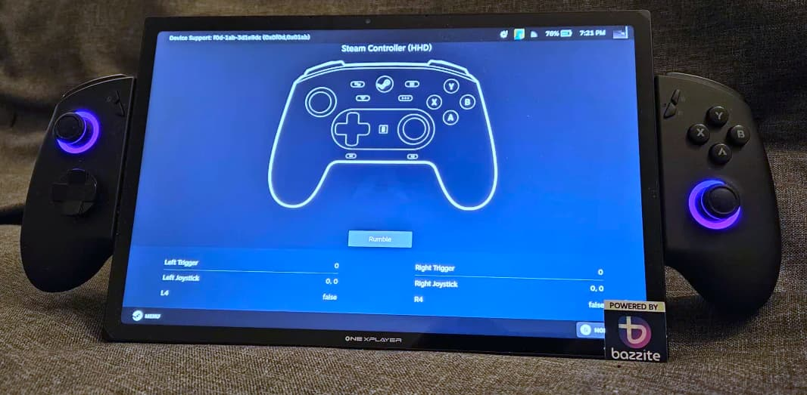

---
authors:
  - "@nicknamenamenick"
---

## OneXPlayer X1

**Status**: Gold

### Installing Bazzite

Read the [**Installing Bazzite on Handheld PCs documentation**](/General/Installation_Guide/Installing_Bazzite_for_Handheld_PCs.md).

### Post-Installation Setup

- Complete the Bazzite Portal
- Login to Steam
- Reboot device
- Configure the HHD Overlay by opening it with QAM button

### Optional Tweaks

- Adjust RGB with Steam Gaming Mode in Handheld Daemon
- Adjust the scaling of the UI in the Display Settings

### Workarounds / Known Issues
- Fan curves do not work
- Battery capacity limits do not work
- Vibration intensity does not work

## Additional Information

This applies to most handhelds running Bazzite.

### TDP Controls

There are a few options for TDP Controls that work with Bazzite:

- The [HHD-overlay](https://github.com/hhd-dev/hhd/blob/master/readme.md) supports TDP controls.
  - Also has a desktop app that is pre-installed, look for the Handheld Daemon app in Desktop Mode.
- [SimpleDeckyTDP](https://github.com/aarron-lee/SimpleDeckyTDP) supports TDP, GPU, Power Governor, and among other settings.
  - Also has a [graphical application](https://github.com/aarron-lee/SimpleDeckyTDP-Desktop), but needs to be manually installed.
- [PowerControl](https://github.com/mengmeet/PowerControl) supports TDP, GPU, and fan controls on select devices.

### How do I open the HHD Overlay?

Press, hold, or double-tap the Quick Access Menu button.

### Controller Information

OneXPlayer devices are recommended to use the Steam Controller emulation.

#### Desktop Controls

Desktop Mode Controller Layout: It may not exist by default if Steam doesn't setup your handheld controller properly. This can be fixed in Steam's controller settings.

Make sure to **apply** the desktop controls when you select them.

## Contributing

This page is a **wiki**, edit it to add any relevant information you may have regarding the handheld and your experience with Bazzite on it. Make sure to follow proper [contributing guidelines](https://docs.bazzite.gg/Advanced/contributing/) before adding any edits.

**See also**: [Steam Gaming Mode Overview](../Steam_Gaming_Mode.md)

**<-- Back to [Handheld Wiki](./index.md)**
