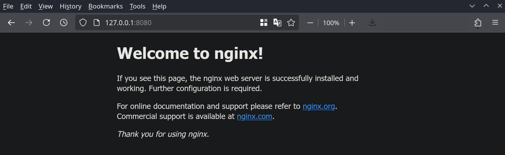

---
authors:
  - "@asen23"
  - "@noelmiller"

preview:
  alpha: 150
  image: "../img/podman.png"
description: "Run services."
---

## What is Quadlet?


Quadlet is a features of [podman](https://podman.io/) that allows a user to run a container as [systemd](https://systemd.io/) units. It works by using a declarative syntax like [docker compose](https://docs.docker.com/compose/) but integrates to systemd and use podman as a backend.

### Quick Example:

Create a file called `~/.config/containers/systemd/nginx.container` with content below.
```
[Container]
ContainerName=nginx
Image=docker.io/nginxinc/nginx-unprivileged
PublishPort=8080:8080
```

Save it and run the code below.

```sh
systemctl --user daemon-reload
systemctl --user start nginx
xdg-open localhost:8080
```



## Use Cases

Quadlet can be used for application packaged as container such as server application. You can find a lot of example of containerized application from [Linux Server](https://docs.linuxserver.io/images/).

## Managing Quadlet

Quadlet can be managed like any other systemd service using below command.

Checking quadlet status
```sh
systemctl --user status nginx
```

Stopping quadlet
```sh
systemctl --user stop nginx
```

You can see more command in [man systemctl](https://man.archlinux.org/man/systemctl.1) or [tldr systemctl](https://tldr.inbrowser.app/pages/linux/systemctl).

### Quadlet file location

You can put your quadlet in these location sorted by priority.
- `$XDG_RUNTIME_DIR/containers/systemd/` - Usually used for temporary quadlet
- `~/.config/containers/systemd/` - Recommended location
- `/etc/containers/systemd/users/$(UID)`
- `/etc/containers/systemd/users/`

!!! note
    
    If you want your service to start even when you are not logged in, run `loginctl enable-linger $USER` to start it automatically.

### Running Quadlet on Startup

You may want to run your quadlet automatically on startup, just add an install section to the quadlet file if you want it to autostart. Most of the time `default.target` is what you want but if you need other target you can read on systemd docs.
```
[Install]
WantedBy=default.target
```

For example:
```
[Container]
ContainerName=nginx
Image=docker.io/nginxinc/nginx-unprivileged
PublishPort=8080:8080

[Install]
WantedBy=default.target
```

!!! note

    You don't need to run `systemctl enable` as the service file are generated. You also cannot run it anyway.

### Converting Docker Compose to Quadlet Unit

You will find that most of containerized app in the web are built using docker compose. Even the Linux Server that is linked above have all container documented using compose file. So you will need to convert it first before running it as quadlet, fortunately you can use [podlet](https://github.com/containers/podlet) to help converting it.

!!! note

    By default quadlet require full repository name. Most image are in docker hub so you can just add `docker.io/` (e.g "nginxinc/nginx-unprivileged" become "docker.io/nginxinc/nginx-unprivileged")

### Running Rootful Container as Quadlet

While ideally you would run all container using rootless podman, sadly not all container will work with it. If you noticed in the beginning, this guide used nginx-unprivileged rather than the normal nginx, this because it needs root to function. To use rootful podman, you will need to use different quadlet path and run using root systemctl (without `--user`).

Rootful Quadlet Path
- `/run/containers/systemd/` - Temporary quadlet
- `/etc/containers/systemd/` - Recommended location
- `/usr/share/containers/systemd/` - Image defined

### Common Quadlet Key Description
| Option        | Example                                     | Description                                                                              |
| ------------- | ------------------------------------------- | ---------------------------------------------------------------------------------------- |
| ContainerName | ContainerName=nginx                         | Name of the container.                                                                   |
| Image         | Image=docker.io/nginxinc/nginx-unprivileged | Container image that you want to use.                                                    |
| PublishPort   | PublishPort=8080:8080                       | Port opened by container. (HOST_PORT:CONTAINER_PORT)                                     |
| Volume        | Volume=/path/to/data:/data:z                | Link host folder with container folder. (HOST_FOLDER:CONTAINER_FOLDER:OPTION)            |
| Network       | Network=host                                | Network used by container. The value can be `host`, `none`, or user defined network name |

!!! note

    The `z` option in volume is to prevent selinux from blocking access to the folder. You can read more [here](https://docs.podman.io/en/stable/markdown/podman-run.1.html#volume-v-source-volume-host-dir-container-dir-options).

## Example

### Minecraft Server

Documentation: https://docker-minecraft-server.readthedocs.io/en/latest
Quadlet File:
```
[Container]
ContainerName=minecraft
Environment=EULA=TRUE
Image=docker.io/itzg/minecraft-server
PublishPort=25565:25565
Volume=/path/to/data:/data:z

# Remove if you don't want autostart
[Install]
WantedBy=default.target
```
!!! note

    Use absolute path for volume, e.g `/home/username/minecraft/data`.

### Plex Server

Documentation: https://github.com/plexinc/pms-docker
Quadlet File:
```
[Container]
ContainerName=plex
Environment=TZ=Your/TimeZone
Image=docker.io/plexinc/pms-docker
Network=host
Volume=/path/to/config:/config:z
Volume=/path/to/transcode:/transcode:z
Volume=/path/to/media:/data:z

# Remove if you don't want autostart
[Install]
WantedBy=default.target
```
!!! note

    You can find list of timezone [here](https://en.wikipedia.org/wiki/List_of_tz_database_time_zones).
!!! note

    Use absolute path for volume, e.g `/home/username/plex/config`.
!!! note

    You can mount multiple volume for your media, e.g `Volume=/path/to/media:/tv:z` and `Volume=/path/to/another/media:/movie:z`. Consult the documentation for more info.

## Project Website

https://podman.io/

### Useful Links
- https://docs.podman.io/en/stable/markdown/podman-systemd.unit.5.html
- https://www.redhat.com/en/blog/quadlet-podman

<hr>

[**<-- Back to Installing and Managing Software on Bazzite**](./index.md)
